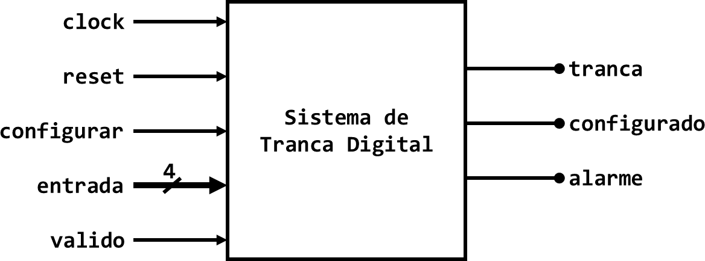

**Março/2024**

# Introdução:

> Neste trabalho, você se aventurará nos domínios dos sistemas de
> segurança, desenvolvendo um sofisticado [Sistema de Tranca
> Digital]{.underline} utilizando o conceito de [Máquinas de Estado
> Finito]{.underline} (FSM, do inglês, *Finite State Machine*). Neste
> cenário, para reforçar as medidas de segurança, é solicitado a você um
> sistema de trava digital que permita acesso apenas a indivíduos que
> possam fornecer a sequência correta de entradas. Sua tarefa é projetar
> e testar esta trava digital. **Este trabalho deve ser desenvolvido
> individualmente ou em grupos de no máximo duas pessoas.**

# Objetivos do Trabalho:

-   **Desenhar Diagrama de Estado:** Crie um diagrama de estado
    detalhado para o sistema de trava digital, mostrando todos os
    estados possíveis, incluindo o status de travado, destravado,
    estados de erro para entradas incorretas e estados intermediários
    para sequências de entrada parcialmente corretas, mas que desviam no
    meio do caminho. Este diagrama deve servir como a espinha dorsal da
    lógica e funcionalidade da sua trava.

-   **Implementação:** Implemente o *design* da FSM utilizando VHDL.
    Esta etapa transforma sua ideia teórica em um módulo tangível e
    testável.

-   **Testes & Validação**: Conduza testes abrangentes e **automáticos**
    do seu modelo de FSM utilizando diversas sequências de entrada para
    demonstrar sua eficácia. Isso inclui:

    -   Sequências de entrada que destravam o sistema com sucesso.

    -   Sequências incorretas que, idealmente, devem levar a um estado
        de erro.

    -   Sequências que são corretas até certo ponto, mas depois desviam,
        levando ao estado de erro.

# Requisitos:

> O circuito deve possuir a seguinte interface:

{width="5.354560367454068in"
height="1.9891666666666667in"}

> O circuito deve obedecer às seguintes especificações:

-   O sistema deve ser desenhado para operar com um *clock* com
    frequência de 80 MHz.

-   O estado inicial do sistema é chamado "desconfigurado" onde as
    saídas são:

    -   configurado = 0, indicando que o sistema está desconfigurado;

    -   tranca = 1, indicando que a tranca está acionada;

    -   alarme = 0, indicando que o alarme não está acionado.

-   Qualquer interação do usuário enquanto o sistema está desconfigurado
    não irá gerar nenhuma alteração no estado da tranca e do alarme.

-   Para entrar no modo que permite a configuração do sistema, o usuário
    deve manter a entrada

> configurar = 1.

-   Ao entrar no modo configuração, o sistema espera a seguinte
    sequência de entradas:

    -   Número de tentativas permitidas até que o alarme seja disparado
        > (zero indica que o alarme nunca irá ser acionado, independente
        > de quantas vezes o usuário erre a senha);

    -   Primeiro dígito da senha;

    -   Segundo dígito da senha;

    -   Terceiro dígito da senha.

-   Durante a configuração, o sistema lê um novo valor do sinal entrada
    a cada pulso do sinal valido

> (um pulso é identificado pela sequência: valido = 0, valido = 1,
> valido = 0).

-   Após inserir os quatro valores que configuram a tranca digital, o
    sistema aguarda até que o sinal configurar vá para zero, enquanto
    isso não ocorre, qualquer outra entrada enviada é ignorada. Quando o
    sinal configurar estiver em zero, o sistema identifica o final da
    etapa de configuração, modificando a saída para configurado = 1, o
    que indica que o sistema entrou em modo de operação.

-   A imagem abaixo, mostra o processo de configuração do sistema. Nesta
    configuração o usuário pode errar 3 vezes a senha antes do disparo
    do alarme e a senha configurada é A07:

> {width="6.818667979002624in"
> height="1.1308333333333334in"}

-   Quando em modo de operação, o circuito fica aguardando a senha do
    usuário. Assim como na configuração, cada dígito da senha é inserido
    pelo sinal entrada e a sua validade é identificada por um pulso do
    sinal valido.

-   Ao receber a senha correta o sistema deve manter o sinal tranca em
    '0' por pelo menos 375µs, tempo necessário para que o atuador da
    tranca valide a abertura da tranca. Depois, o sinal tranca volta
    para o valor *default* (1), e o sistema continua aguardando uma nova
    interação com o usuário.

-   Se a senha recebida for inválida, nenhuma resposta é dada ao
    usuário. Exceto se o usuário tenha fornecido a senha errada vezes
    suficientes do que foi configurado. Neste caso, o alarme é disparado
    (alarme = 1) e só para após a correta inserção da senha.

# Objetivos do Trabalho:

> **Entrega:** um .zip (nomeado: *aluno1aluno2.zip*) contendo:

-   (50% da nota) Relatório com a máquina de estados desenhada para
    modelar o comportamento do circuito solicitado. [Utilize a
    ferramenta para desenhar a máquina:
    <https://madebyevan.com/fsm/>]{.underline}

    -   Explicação da máquina de estados, contendo **(40%)**:

        -   A descrição de cada estado

        -   Descrição de todas as condições de troca de estado

    -   Descrição dos testes que estão codificados no *testbench*
        **(10%)**.

-   (50% da nota) Todos os arquivos necessários para simulação

    -   O código VHDL desenvolvido, comentado **(25%)**

    -   *Testbench* **(15%)**

    -   Script de simulação (sim.do) **(5%)**

    -   Script de forma de onda (wave.do) **(5%)**

# Data de Entrega:

> ~~Entrega regular: 27/03/2024 - 9:45~~
>
> ~~Entrega atrasada: (-25%): 28/03/2024 - 23:59~~ Entrega regular:
> 28/03/2024 - 23:59
>
> Entrega atrasada: (-25%): 29/03/2024 - 23:59
>
> **Não haverá apresentação deste trabalho.**
>
> **Detecção de plágio anula a nota de todos os envolvidos.**
>
> **Não será aceito trabalho entregue fora do prazo determinado.**
